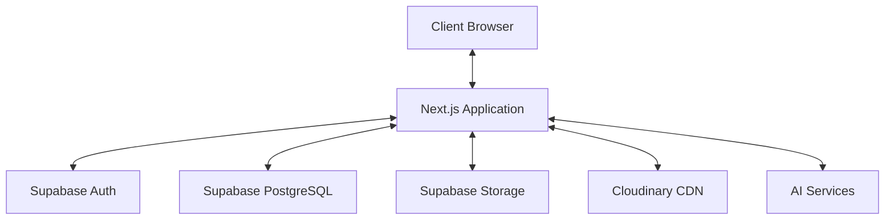
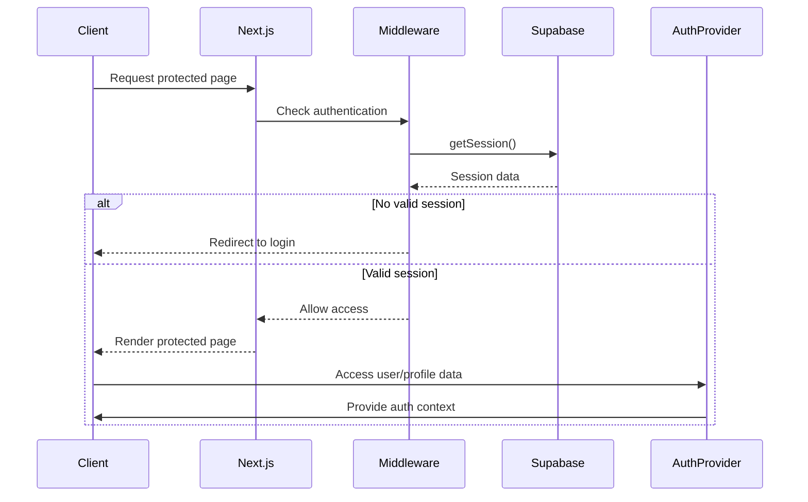
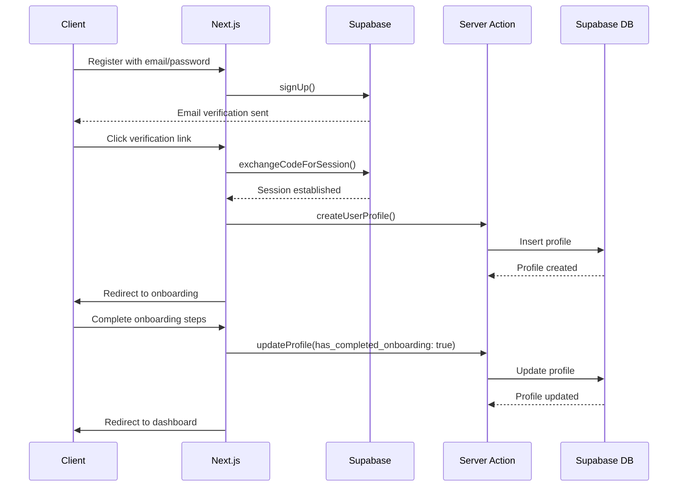
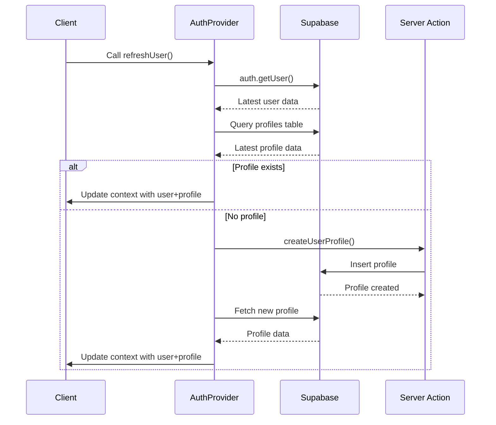
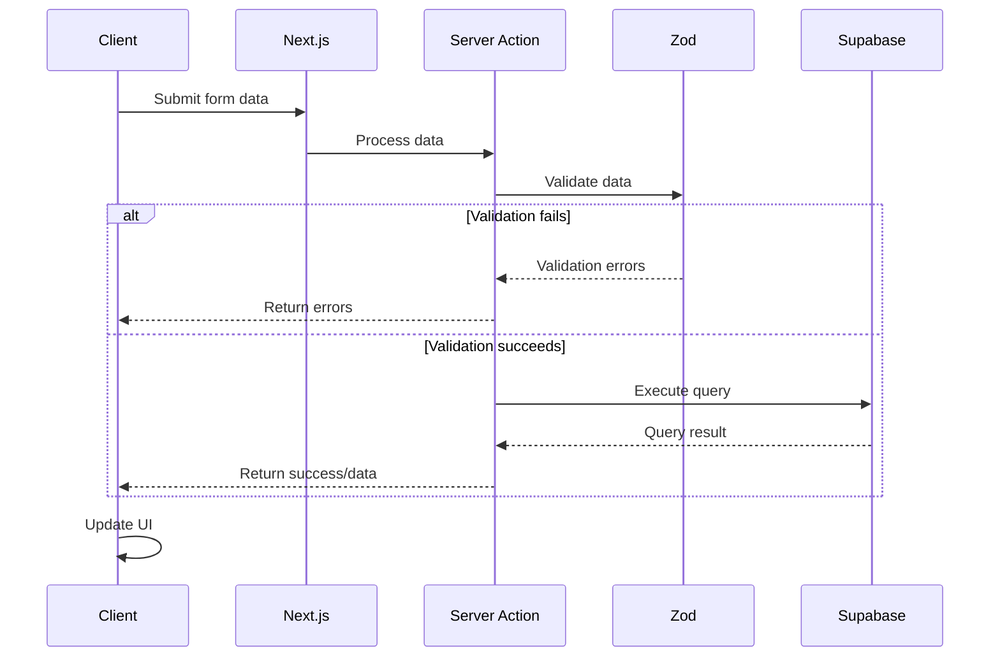
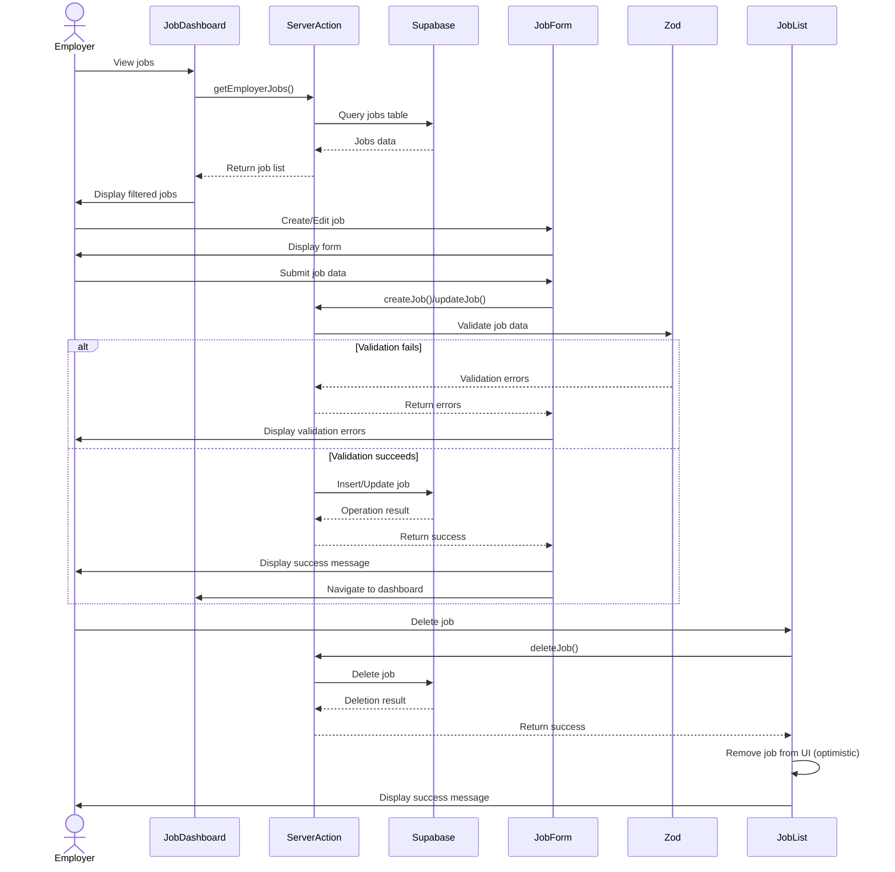

# System Patterns: OJTech

## Core Architecture

The OJTech platform follows a modern web application architecture with the following key components:

1. **Frontend Layer**
   - Next.js 13+ App Router for routing and server components
   - React for UI components and client-side interactivity
   - Tailwind CSS for styling
   - shadcn/ui component library for consistent UI elements

2. **Backend Layer**
   - Next.js server components and server actions
   - Supabase for authentication, database, and storage
   - Cloudinary for media storage and optimization

3. **Data Layer**
   - PostgreSQL database (via Supabase)
   - Row Level Security (RLS) policies for data protection
   - Database triggers for data integrity
   - Check constraints for data validation

## System-Wide Patterns

### Authentication System

The authentication system uses Supabase Auth with the following workflow:

1. **Registration Flow**
   - User signs up with email/password or GitHub OAuth
   - Email verification is sent for email/password users
   - Upon verification, user is redirected to onboarding

2. **Login Flow**
   - User logs in with credentials
   - Auth state is managed by AuthProvider context
   - Protected routes are enforced via middleware

3. **Session Management**
   - Auth state persisted via Supabase Auth session
   - refreshUser() function updates auth state when needed
   - Auth context provides user data to components

### Data Access Pattern

Data operations follow a consistent pattern using server actions:

1. **Server Actions**
   - Located in `/lib/actions/` directory
   - Organized by domain (e.g., student-profile.ts, job-actions.ts)
   - Naming follows camelCase verb-noun convention (e.g., updateStudentProfile)

2. **Response Format**
   - All server actions return a standardized response:
   ```typescript
   {
     success: boolean;
     data?: any;
     error?: string;
   }
   ```

3. **Error Handling**
   - Try/catch blocks wrap database operations
   - Specific error messages captured for debugging
   - Generalized error messages returned to client
   - Toast notifications for user feedback

### Database Constraints

The system uses database constraints to ensure data integrity:

1. **Check Constraints**
   - Used to limit values in specific columns
   - Example: `matches_status_check` constrains status to valid values

2. **Status Values**
   - Jobs table: 'open', 'closed', 'draft'
   - Matches table: 'pending', 'accepted', 'rejected', 'applied', 'declined'
   - Job applications table: 'pending', 'reviewed', 'shortlisted', 'rejected', 'hired'

3. **Constraint Documentation**
   - Tracked in `/docs/database_constraints.md`
   - Used to document the purpose and allowed values of constraints
   - Documents migrations that modify constraints

4. **Migration Pattern**
   - Constraints are created and modified via migrations
   - Migrations are versioned with date prefixes
   - Follow pattern: drop existing constraint, recreate with updated values

### User Role Management

The system handles multiple user roles with specialized functionality:

1. **Role Types**
   - Student: Access to profile, job searching, applications
   - Employer: Access to company profile, job posting, application review
   - Admin: Access to system management (future)

2. **Role-Based Access Control**
   - Database RLS policies restrict data access by role
   - Middleware protects routes based on role
   - UI conditionally renders elements based on role
   - Server actions verify role before operations

## Job Management System

The job management system enables employers to create and manage job postings with the following architecture:

### Data Structure

1. **Jobs Table**
   ```sql
   CREATE TABLE jobs (
     id UUID PRIMARY KEY DEFAULT uuid_generate_v4(),
     employer_id UUID REFERENCES profiles(id),
     title TEXT NOT NULL,
     description TEXT NOT NULL,
     location TEXT,
     salary_range TEXT,
     required_skills JSONB,
     preferred_skills JSONB,
     status TEXT DEFAULT 'draft' CHECK (status IN ('open', 'closed', 'draft')),
     application_deadline TIMESTAMP WITH TIME ZONE,
     created_at TIMESTAMP WITH TIME ZONE DEFAULT NOW(),
     updated_at TIMESTAMP WITH TIME ZONE DEFAULT NOW()
   );
   ```

2. **Job Status Workflow**
   - Draft: Initial state, not visible to students
   - Open: Published state, visible to students
   - Closed: No longer accepting applications

### Component Architecture

1. **Job Dashboard** (`/app/employer/jobs/page.tsx`)
   - Main entry point for job management
   - Displays job listings with filtering by status
   - Shows job statistics

2. **Job List Component** (`/components/jobs/JobList.tsx`)
   - Reusable component for displaying job listings
   - Handles empty states and loading states
   - Provides actions appropriate to job status

3. **Job Card Component** (`/components/jobs/JobCard.tsx`)
   - Displays concise job information
   - Shows status indicators and action buttons
   - Responsive design for different screen sizes

### Server Actions

1. **Job CRUD Operations** (`/lib/actions/job-actions.ts`)
   - `getEmployerJobs`: Retrieves jobs for a specific employer
   - `getJobById`: Retrieves a specific job by ID
   - `createJob`: Creates a new job posting
   - `updateJob`: Updates an existing job
   - `deleteJob`: Removes a job posting
   - `changeJobStatus`: Updates job status (draft/active/closed)

2. **Security Measures**
   - Employer ID verification for all operations
   - Input validation with Zod schemas
   - Role-based access control
   - Row Level Security policies in database

### User Interface Patterns

1. **Status-Based UI**
   - Different actions available based on job status
   - Visual indicators for different statuses
   - Tabbed interface for filtering by status

2. **Confirmation Dialogs**
   - Used for destructive actions (delete)
   - Modal pattern with clear messaging
   - Cancel and confirm options

3. **Form Patterns**
   - Zod schemas for validation
   - React Hook Form for form state management
   - Inline error messages
   - Loading states during submission

## Job Application System

The job application system manages how students apply for jobs with the following architecture:

### Data Structure

1. **Matches Table**
   ```sql
   CREATE TABLE matches (
     id UUID PRIMARY KEY DEFAULT uuid_generate_v4(),
     student_id UUID REFERENCES student_profiles(id),
     job_id UUID REFERENCES jobs(id),
     match_score DECIMAL(5,2) CHECK (match_score >= 0 AND match_score <= 100),
     status VARCHAR(50) DEFAULT 'pending' CHECK (status IN ('pending', 'accepted', 'rejected', 'applied', 'declined')),
     created_at TIMESTAMP WITH TIME ZONE DEFAULT CURRENT_TIMESTAMP,
     updated_at TIMESTAMP WITH TIME ZONE DEFAULT CURRENT_TIMESTAMP,
     UNIQUE(student_id, job_id)
   );
   ```

2. **Job Applications Table**
   ```sql
   CREATE TABLE job_applications (
     id UUID PRIMARY KEY DEFAULT uuid_generate_v4(),
     job_id UUID NOT NULL REFERENCES jobs(id) ON DELETE CASCADE,
     student_id UUID NOT NULL REFERENCES profiles(id) ON DELETE CASCADE,
     cv_id UUID NOT NULL REFERENCES cvs(id) ON DELETE CASCADE,
     cover_letter TEXT,
     status TEXT DEFAULT 'pending',
     employer_notes TEXT,
     created_at TIMESTAMP WITH TIME ZONE DEFAULT CURRENT_TIMESTAMP,
     updated_at TIMESTAMP WITH TIME ZONE DEFAULT CURRENT_TIMESTAMP
   );
   ```

3. **Match Status Workflow**
   - Pending: Initial state, match exists but no action taken
   - Applied: Student has applied for the job
   - Declined: Student has declined the job opportunity
   - Accepted: Application has been accepted by employer (future)
   - Rejected: Application has been rejected by employer (future)

4. **Application Status Workflow**
   - Pending: Initial state, application submitted but not reviewed
   - Reviewed: Employer has reviewed the application
   - Shortlisted: Application selected for further consideration
   - Rejected: Application not selected
   - Hired: Candidate hired for the position

### Application Process

1. **Application Flow**
   - Student browses job opportunities
   - Student selects a job to apply for
   - System generates recommendation letter
   - System updates match status to 'applied'
   - Creates record in job_applications table
   - Employer notified of new application (future)

2. **Declining Flow**
   - Student can decline job opportunities
   - System updates match status to 'declined'
   - Job no longer appears in active opportunities

### Server Actions

1. **Application Actions** (`/lib/actions/opportunities.ts`)
   - `getMatchedJobsForCurrentUser`: Retrieves jobs that match student skills
   - `applyForJob`: Records student's decision to apply
   - `declineJob`: Records student's decision to decline
   - `generateRecommendationLetter`: Creates AI-generated recommendation

2. **Security Measures**
   - Student ID verification for all operations
   - Database constraints ensure valid status values
   - Proper error handling for constraint violations

## Application Tracking System

The application tracking system enables students to monitor their job applications with the following architecture:

### Data Access

1. **Application Retrieval** (`/lib/actions/application.ts`)
   - `getStudentApplications`: Retrieves all applications for the current student
   - Joins application data with job details and employer information
   - Supports pagination, filtering by status, and sorting

2. **Data Relationships**
   - Each application links to a job and student profile
   - Applications include CV reference for submitted resume
   - Full job details available through relationship

### Component Structure

1. **Track Page** (`/app/track/page.tsx`)
   - Main entry point for students to track applications
   - Displays all applications with status indicators
   - Supports filtering by application status
   - Shows skills from CV and matches with job requirements

2. **UI Elements**
   - Tabbed interface for status filtering
   - Cards for each application with detailed information
   - Progress indicators for skills matching
   - Status badges with distinct colors
   - Loading and empty states with helpful guidance

3. **Skills Visualization**
   - Displays user skills extracted from CV
   - Shows skills required by each job
   - Calculates and visualizes skills match percentage
   - Highlights matching skills for better visibility

### UX Patterns

1. **Status-Based Display**
   - Color-coded status badges (pending: yellow, reviewed: blue, etc.)
   - Status-specific next steps information
   - Filtered views based on application status

2. **Empty States**
   - Contextual messages based on selected filter
   - Call-to-action buttons for empty state (Browse Jobs)
   - Clear guidance on what to do next

3. **Loading States**
   - Loading spinners during data fetching
   - Skeleton loaders for content (future)
   - Error handling with retry options

4. **Navigation Links**
   - Direct links to view job details
   - Button to browse more opportunities
   - Future: links to interview schedules, messages

### State Management

1. **Client-Side Filtering**
   - Applications fetched once on component mount
   - Tab-based filtering handled client-side
   - State updates trigger re-rendering with filtered data

2. **Data Loading**
   - Loading state during initial data fetch
   - Error handling with toast notifications
   - Empty state handling for no applications
   - Status-specific empty states

## File Upload System

The file upload system handles user documents (CV) and images with the following approach:

1. **Upload Process**
   - Client-side file validation
   - Direct upload to Cloudinary
   - Server-side verification and database update

2. **Storage Strategy**
   - Files stored in Cloudinary with secure URLs
   - File metadata stored in Supabase
   - Document versioning supported

3. **Access Control**
   - File URLs contain signed tokens for security
   - Database RLS policies restrict metadata access
   - User can only access their own files

## Error Handling Strategy

The application implements a consistent error handling approach:

1. **Client-Side Validation**
   - Form validation with Zod schemas
   - Inline error messages for user feedback
   - Prevents invalid submissions

2. **Server-Side Validation**
   - Input validation on server actions
   - Database constraints enforce data integrity
   - Typed parameters with Zod parsing
   - Security checks before database operations

3. **Error Reporting**
   - Standardized error response format
   - Toast notifications for user feedback
   - Detailed logging for debugging
   - Proper handling of database constraint violations

## Database Migration Strategy

The application uses a systematic approach to database migrations:

1. **Migration Files**
   - Stored in `/supabase/migrations/` directory
   - Named with date prefix for ordering (e.g., `20250508_update_matches_status_constraint.sql`)
   - Each file contains a single logical change

2. **Migration Operations**
   - Create/alter tables and columns
   - Add/modify constraints
   - Create/update indexes
   - Define triggers and functions

3. **Constraint Management**
   - Drop existing constraint before modifying
   - Create new constraint with updated values
   - Document changes in code comments and separate documentation

4. **Deployment Process**
   - Migrations applied to development environment first
   - Tested thoroughly before production deployment
   - Applied to production using Supabase API
   - Logged for audit purposes

## Component Structure

UI components follow a consistent organization pattern:

1. **Layout Components**
   - Page layouts in `/app/**/layout.tsx`
   - Shared layouts in `/components/layout/`
   - Provide consistent structure and navigation

2. **Feature Components**
   - Organized by feature domain in `/components/[feature]/`
   - Self-contained with minimal dependencies
   - Reusable across different pages

3. **UI Components**
   - Basic UI elements in `/components/ui/`
   - Extended shadcn/ui components
   - Consistent styling and behavior

## Form Handling Pattern

Forms follow a consistent implementation pattern:

1. **Form Schema Definition**
   - Zod schemas define form structure and validation
   - Located near the form components they validate
   - Reused for both client and server validation

2. **Form Implementation**
   - React Hook Form for state management
   - Form submission via server actions
   - Loading states during submission
   - Error handling for validation and server errors

3. **Form Feedback**
   - Inline error messages for form fields
   - Toast notifications for form submission results
   - Loading indicators during submission

## State Management

Application state is managed through several approaches:

1. **Server State**
   - Primary data stored in Supabase
   - Fetched via server components and server actions
   - Refreshed on key user actions

2. **Client State**
   - React useState and useReducer for local component state
   - React Context for shared state (auth, theme)
   - Local filtering and sorting handled client-side

3. **Form State**
   - Managed with React Hook Form
   - Validation state with Zod
   - Submission state (loading, error, success)

## Navigation Pattern

The application implements a consistent navigation structure:

1. **Main Navigation**
   - Navbar for primary navigation
   - Role-based navigation items
   - Account menu for user-specific actions

2. **Secondary Navigation**
   - Breadcrumbs for hierarchical navigation
   - Tabs for related content views
   - Back buttons for multi-step processes

3. **Action Navigation**
   - Primary action buttons prominently placed
   - Cancel options for destructive actions
   - Confirmation for important changes

## Architecture Overview

OJTech follows a modern web application architecture based on Next.js with Supabase as the backend service:



## Key Design Patterns

### 1. Authentication Pattern
- **Pattern**: Middleware-based route protection with centralized auth provider
- **Implementation**: 
  - Next.js middleware intercepts requests to protected routes
  - React Context provider manages auth state throughout the application
  - Multiple profile creation safeguards at different points in the flow
  - refreshUser mechanism to update state after critical operations
- **Flow**:
  1. User requests protected route
  2. Middleware checks Supabase auth session
  3. Redirects to login if not authenticated
  4. Proceeds to requested route if authenticated
  5. AuthProvider provides user and profile data to component
  6. Components call refreshUser when critical updates happen

### 2. Data Access Pattern
- **Pattern**: Server Actions as API endpoints
- **Implementation**: Next.js server actions with Supabase client
- **Flow**:
  1. Client invokes server action from component
  2. Server action executes database operation via Supabase client
  3. Returns response to client
  4. Client updates UI accordingly

### 3. Form Handling Pattern
- **Pattern**: React Hook Form with Zod validation
- **Implementation**: Form components use useForm hook with zodResolver
- **Flow**:
  1. Define Zod schema for form validation
  2. Initialize form with useForm and zodResolver
  3. Register form fields
  4. Submit handler executes server action with validated data

### 4. Error Handling Pattern
- **Pattern**: Try-catch with standardized error responses
- **Implementation**: Server actions wrap database operations in try-catch blocks
- **Flow**:
  1. Attempt database operation
  2. Catch and log any errors
  3. Return standardized response object with success/error status
  4. Client displays toast notification based on response

### 5. Loading State Pattern
- **Pattern**: Local component loading states
- **Implementation**: useState hook for loading indicators
- **Flow**:
  1. Set loading state to true before operation
  2. Execute async operation
  3. Set loading state to false on completion
  4. Render different UI based on loading state

### 6. Profile Synchronization Pattern
- **Pattern**: Bi-directional table sync with cascading updates
- **Implementation**: 
  - Server actions update both profiles and student_profiles tables
  - Critical flags like has_completed_onboarding propagate across tables
  - Multiple safeguards and retries for critical operations
- **Flow**:
  1. Update operation initiated on one table (profiles or student_profiles)
  2. Primary table update occurs
  3. Relevant fields are mapped to the secondary table
  4. Secondary table is updated with mapped fields
  5. Full transaction completes or rolls back

### 7. Job Management Pattern
- **Pattern**: Status-based workflow management with filtered views
- **Implementation**: 
  - Jobs have distinct status states (draft, active, closed)
  - UI provides tabbed filtering based on status
  - Count-based statistics for each status
  - Status transitions with validation rules
- **Flow**:
  1. User creates job (initially in draft state)
  2. User completes required fields and publishes job (transitions to active)
  3. Job becomes visible to students when active
  4. User can close job when no longer accepting applications (transitions to closed)
  5. Dashboard displays all jobs with filtering by status

### 8. Backward Compatibility Pattern
- **Pattern**: Dual-field updates with compatibility checks
- **Implementation**: 
  - Server actions check for both legacy and current field names
  - Updates write to both field sets when necessary
  - UI components have fallback checks for field existence
- **Flow**:
  1. Server action receives update request
  2. Maps current schema fields to legacy fields where needed
  3. Performs database operation with both field sets
  4. UI reads from current fields first, falls back to legacy fields

## Component Relationships

### Page Components
- Implement page-specific logic and layout
- Combine multiple UI and functional components
- Handle page-level state
- Invoke server actions

### UI Components
- Implement reusable UI elements
- Accept props for configuration
- Follow shadcn/ui patterns
- Maintain internal state when needed

### Layout Components
- Define application shell
- Provide consistent navigation
- Handle theme management
- Present toast notifications

### Form Components
- Implement specific forms (profile, job posting, etc.)
- Handle form validation
- Manage form submission
- Display form errors

### List Components
- Display tabular or card-based data
- Implement sorting, filtering, and pagination
- Provide action buttons for CRUD operations
- Handle optimistic UI updates

## Data Flow Patterns

### Authentication Flow


### User Registration & Onboarding Flow


### Profile Refresh Flow


### Data Mutation Flow


### Job Management Flow


## Code Organization

### Directory Structure
- `/app`: Application routes and page components (Next.js App Router)
- `/components`: Reusable UI components
- `/components/ui`: shadcn/ui components
- `/components/employer`: Employer-specific components
- `/lib`: Utility functions and shared code
- `/lib/actions`: Server actions
- `/lib/types`: TypeScript interfaces and types
- `/lib/utils`: Helper functions
- `/lib/constants`: Application constants
- `/public`: Static assets

### Naming Conventions
- **React Components**: PascalCase (e.g., `StudentProfile.tsx`)
- **Server Actions**: camelCase (e.g., `createStudentProfile.ts`)
- **Utility Functions**: camelCase (e.g., `formatDate.ts`)
- **Folder Names**: kebab-case (e.g., `auth-components`)
- **CSS Class Names**: Tailwind utility classes

## Technical Decision Records

### TDR-001: Next.js App Router
- **Decision**: Use Next.js App Router instead of Pages Router
- **Rationale**: Better support for server components, simpler routing, improved performance
- **Trade-offs**: Newer API with less community examples, learning curve

### TDR-002: Supabase Backend
- **Decision**: Use Supabase instead of custom backend
- **Rationale**: Faster development, built-in auth, PostgreSQL database, storage solutions
- **Trade-offs**: Less control over backend infrastructure, vendor lock-in

### TDR-003: shadcn/ui Components
- **Decision**: Use shadcn/ui instead of MUI or other component libraries
- **Rationale**: Lightweight, customizable, good TypeScript support, Tailwind integration
- **Trade-offs**: Requires more manual assembly than comprehensive libraries

### TDR-004: Cloudinary for File Storage
- **Decision**: Use Cloudinary for CV and image storage
- **Rationale**: Built-in optimization, transformations, CDN delivery
- **Trade-offs**: Additional external service, cost considerations

### TDR-005: Server Actions
- **Decision**: Use Server Actions instead of API Routes
- **Rationale**: Tighter integration with components, simpler development model
- **Trade-offs**: Newer feature with evolving best practices

### TDR-006: Centralized Auth Provider
- **Decision**: Use React Context for auth state management
- **Rationale**: Reduces code duplication, provides consistent auth state, simplifies components
- **Trade-offs**: Adds complexity to initial setup, requires careful state management

### TDR-007: Multi-Table Profile System
- **Decision**: Use both profiles and student_profiles tables with syncing
- **Rationale**: Supports transition from legacy schema, maintains data integrity, enables role-based profiles
- **Trade-offs**: Requires sync logic, potential consistency issues if not managed properly

### TDR-008: Job Status Workflow
- **Decision**: Implement status-based job workflow (draft, active, closed)
- **Rationale**: Provides flexibility for employers, clear life cycle for job postings, better UX
- **Trade-offs**: Additional complexity in filtering and state management

### TDR-009: Backward Compatible Schema Design
- **Decision**: Support both legacy and new field names in the jobs table
- **Rationale**: Ensures compatibility with existing data, avoids breaking changes during transition
- **Trade-offs**: Increased complexity in server actions, additional maintenance burden 