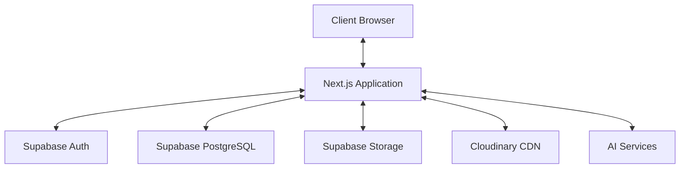
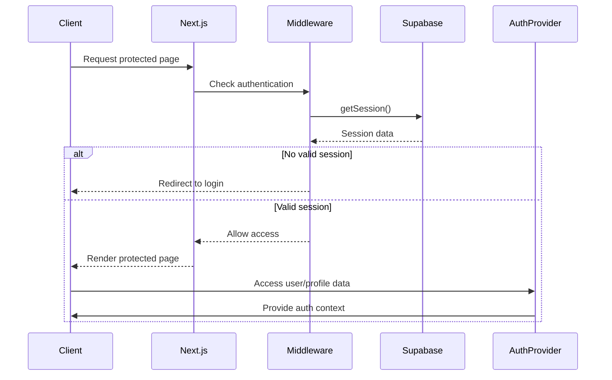
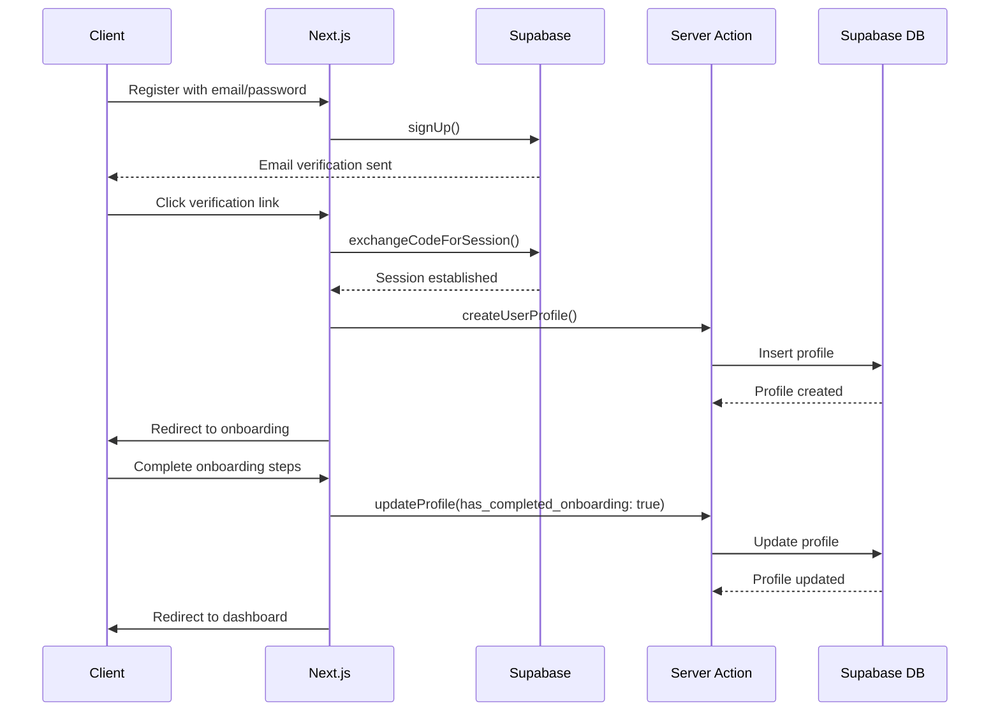
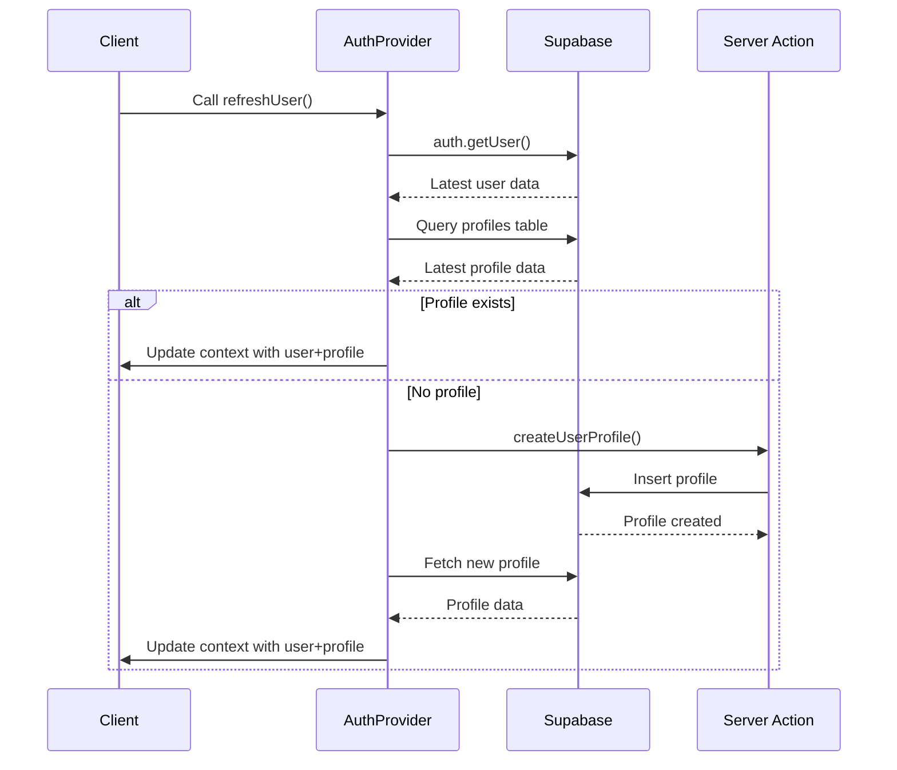
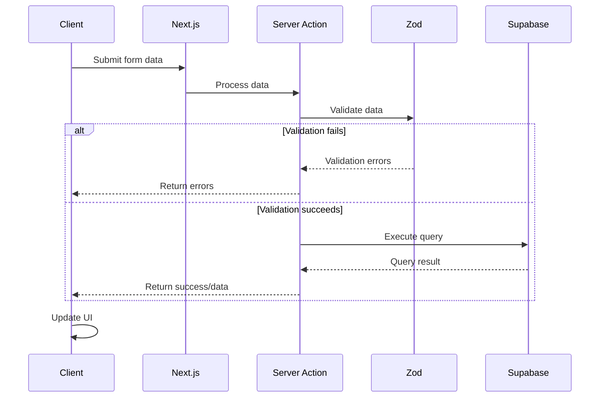

# System Patterns: OJTech

## Architecture Overview

OJTech follows a modern web application architecture based on Next.js with Supabase as the backend service:

## Key Design Patterns

### 1. Authentication Pattern
- **Pattern**: Middleware-based route protection with centralized auth provider
- **Implementation**: 
  - Next.js middleware intercepts requests to protected routes
  - React Context provider manages auth state throughout the application
  - Multiple profile creation safeguards at different points in the flow
  - refreshUser mechanism to update state after critical operations
- **Flow**:
  1. User requests protected route
  2. Middleware checks Supabase auth session
  3. Redirects to login if not authenticated
  4. Proceeds to requested route if authenticated
  5. AuthProvider provides user and profile data to component
  6. Components call refreshUser when critical updates happen

### 2. Data Access Pattern
- **Pattern**: Server Actions as API endpoints
- **Implementation**: Next.js server actions with Supabase client
- **Flow**:
  1. Client invokes server action from component
  2. Server action executes database operation via Supabase client
  3. Returns response to client
  4. Client updates UI accordingly

### 3. Form Handling Pattern
- **Pattern**: React Hook Form with Zod validation
- **Implementation**: Form components use useForm hook with zodResolver
- **Flow**:
  1. Define Zod schema for form validation
  2. Initialize form with useForm and zodResolver
  3. Register form fields
  4. Submit handler executes server action with validated data

### 4. Error Handling Pattern
- **Pattern**: Try-catch with standardized error responses
- **Implementation**: Server actions wrap database operations in try-catch blocks
- **Flow**:
  1. Attempt database operation
  2. Catch and log any errors
  3. Return standardized response object with success/error status
  4. Client displays toast notification based on response

### 5. Loading State Pattern
- **Pattern**: Local component loading states
- **Implementation**: useState hook for loading indicators
- **Flow**:
  1. Set loading state to true before operation
  2. Execute async operation
  3. Set loading state to false on completion
  4. Render different UI based on loading state

### 6. Profile Synchronization Pattern
- **Pattern**: Bi-directional table sync with cascading updates
- **Implementation**: 
  - Server actions update both profiles and student_profiles tables
  - Critical flags like has_completed_onboarding propagate across tables
  - Multiple safeguards and retries for critical operations
- **Flow**:
  1. Update operation initiated on one table (profiles or student_profiles)
  2. Primary table update occurs
  3. Relevant fields are mapped to the secondary table
  4. Secondary table is updated with mapped fields
  5. Full transaction completes or rolls back

## Component Relationships

### Page Components
- Implement page-specific logic and layout
- Combine multiple UI and functional components
- Handle page-level state
- Invoke server actions

### UI Components
- Implement reusable UI elements
- Accept props for configuration
- Follow shadcn/ui patterns
- Maintain internal state when needed

### Layout Components
- Define application shell
- Provide consistent navigation
- Handle theme management
- Present toast notifications

### Form Components
- Implement specific forms (profile, job posting, etc.)
- Handle form validation
- Manage form submission
- Display form errors

## Data Flow Patterns

### Authentication Flow

### User Registration & Onboarding Flow

### Profile Refresh Flow

### Data Mutation Flow

## Code Organization

### Directory Structure
- `/app`: Application routes and page components (Next.js App Router)
- `/components`: Reusable UI components
- `/components/ui`: shadcn/ui components
- `/lib`: Utility functions and shared code
- `/lib/actions`: Server actions
- `/lib/types`: TypeScript interfaces and types
- `/lib/utils`: Helper functions
- `/lib/constants`: Application constants
- `/public`: Static assets

### Naming Conventions
- **React Components**: PascalCase (e.g., `StudentProfile.tsx`)
- **Server Actions**: camelCase (e.g., `createStudentProfile.ts`)
- **Utility Functions**: camelCase (e.g., `formatDate.ts`)
- **Folder Names**: kebab-case (e.g., `auth-components`)
- **CSS Class Names**: Tailwind utility classes

## Technical Decision Records

### TDR-001: Next.js App Router
- **Decision**: Use Next.js App Router instead of Pages Router
- **Rationale**: Better support for server components, simpler routing, improved performance
- **Trade-offs**: Newer API with less community examples, learning curve

### TDR-002: Supabase Backend
- **Decision**: Use Supabase instead of custom backend
- **Rationale**: Faster development, built-in auth, PostgreSQL database, storage solutions
- **Trade-offs**: Less control over backend infrastructure, vendor lock-in

### TDR-003: shadcn/ui Components
- **Decision**: Use shadcn/ui instead of MUI or other component libraries
- **Rationale**: Lightweight, customizable, good TypeScript support, Tailwind integration
- **Trade-offs**: Requires more manual assembly than comprehensive libraries

### TDR-004: Cloudinary for File Storage
- **Decision**: Use Cloudinary for CV and image storage
- **Rationale**: Built-in optimization, transformations, CDN delivery
- **Trade-offs**: Additional external service, cost considerations

### TDR-005: Server Actions
- **Decision**: Use Server Actions instead of API Routes
- **Rationale**: Tighter integration with components, simpler development model
- **Trade-offs**: Newer feature with evolving best practices

### TDR-006: Centralized Auth Provider
- **Decision**: Use React Context for auth state management
- **Rationale**: Reduces code duplication, provides consistent auth state, simplifies components
- **Trade-offs**: Adds complexity to initial setup, requires careful state management

### TDR-007: Multi-Table Profile System
- **Decision**: Use both profiles and student_profiles tables with syncing
- **Rationale**: Supports transition from legacy schema, maintains data integrity, enables role-based profiles
- **Trade-offs**: Requires sync logic, potential consistency issues if not managed properly 